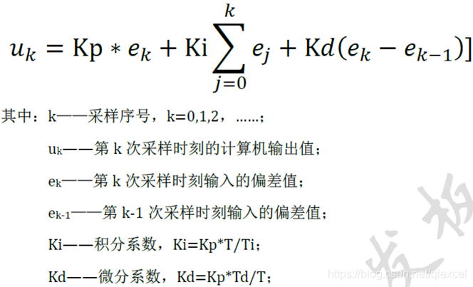
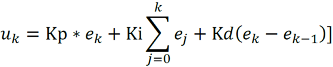
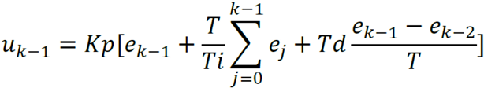
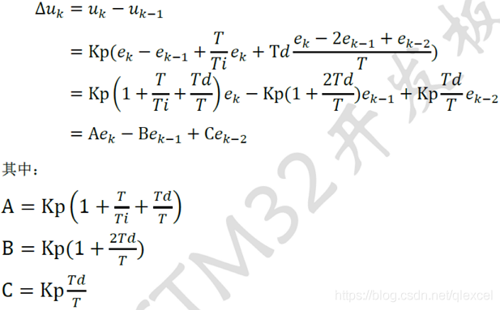

### PID分为位置式PID与增量式PID。

**一、位置式PID**

1、表达式为：



2、缺点：

1）、由于全量输出，所以每次输出均与过去状态有关，计算时要对ek进行累加，工作量大；

2）、因为计算机输出的uk对应的是执行机构的实际位置，如果计算机出现故障，输出的uk将大幅度变化，会引起执行机构的大幅度变化，有可能因此造成严重的生产事故，这在实生产际中是不允许的

3）、如果偏差一直是正的或者负的，位置式PID在积分项会一直累积，因此必须对积分项进行限幅，同时也要对输出进行限幅。当偏差开始反向变化，位置式PID在积分项需要一段时间才能从最大值减下来，造成输出的滞后。

3、总结

由于位置式PID积分项的滞后性，所以使用位置式PID时，一般直接使用PD控制。

位置式 PID 也大多用在执行机构不带积分部件的对象，即PD控制，比如舵机和平衡小车的直立和温控系统的控制。

4、代码

```c
#define PID_INTEGRAL_ON    //位置式PID是否包含积分项。如果仅用PD控制，注释本行
 
typedef struct PID
{ 
    float P;               
    float I;
    float D;	
#ifdef 	PID_INTEGRAL_ON
    float Integral;        //位置式PID积分项
    float IntegralMax;     //位置式PID积分项最大值，用于限幅
#endif	
    float Last_Error;      //上一次误差	
    float OutputMax;       //位置式PID输出最大值，用于限幅
}PID;
 
/**********************************************************************************************************
*	函 数 名：PID_Cal
*	功能说明：位置式PID控制
*   输    入：
    NowValue:当前值
    AimValue:目标值
*   输    出：PID控制值，直接赋值给执行函数
**********************************************************************************************************/ 
float PID_Cal(PID *pid, int32_t NowValue, int32_t AimValue)
{
 
    float  iError,     //当前误差
            Output;    //控制输出	
 
    iError = AimValue - NowValue;                   //计算当前误差
	
#ifdef 	PID_INTEGRAL_ON	
    pid->Integral += pid->I * iError;	            //位置式PID积分项累加
    pid->Integral = pid->Integral > pid->IntegralMax?pid->IntegralMax:pid->Integral;  //积分项上限幅
    pid->Integral = pid->Integral <-pid->IntegralMax?-pid->IntegralMax:pid->Integral; //积分项下限幅
#endif		
	
    Output = pid->P * iError                        //比例P            
           + pid->D * (iError - pid->Last_Error);   //微分D
	
#ifdef 	PID_INTEGRAL_ON		
    Output += pid->Integral;                        //积分I
#endif	
 
    Output = Output > pid->OutputMax?pid->OutputMax:Output;  //控制输出上限幅
    Output = Output <-pid->OutputMax?-pid->OutputMax:Output; //控制输出下限幅
	
	pid->Last_Error = iError;		  	                     //更新上次误差，用于下次计算 
	return Output;	//返回控制输出值
}
```

二、增量式PID

1、表达式为：

当前的控制输出值表达式：



前一时刻的控制输出值表达式：



把两式相减即可得到控制输出值的增量值，也就是增量式PID的表达式：



2、优点

1）、根据增量式PID的表达式可以很好地看出，一旦确定了 KP、TI  、TD，只要使用前后三次测量值的偏差， 即可由公式求出控制增量。而得出的控制量▲uk对应的是近几次位置误差的增量，而不是对应与实际位置的偏差，因此没有误差累加。

2）、增量式PID中不需要累加，计算量小。控制增量Δu(k)的确定仅与最近3次的采样值有关，容易通过加权处理获得比较好的控制效果，并且在系统发生问题时，增量式不会严重影响系统的工作。

3、缺点：

1）、积分截断效应大，有稳态误差；

2）、溢出的影响大。有的被控对象用增量式则不太好；

3、总结

1）、增量式算法不需要做累加，控制量增量的确定仅与最近几次偏差采样值有关，计算误差对控制 量计算的影响较小。而位置式算法要用到过去偏差的累加值，容易产生较大的累加误差。 

2）、增量式算法得出的是控制量的增量，例如在阀门控制中，只输出阀门开度的变化部分，误动作影响小，必要时还可通过逻辑判断限制或禁止本次输出，不会严重影响系统的工作。 而位置式的输出直接对应对象的输出，因此对系统影响较大。

3）、增量式PID控制输出的是控制量增量，并无积分作用，因此该方法适用于执行机构带积分部件的对象，如步进电机等，而位置式PID适用于执行机构不带积分部件的对象，如电液伺服阀。

4）、在进行PID控制时，位置式PID需要有积分限幅和输出限幅，而增量式PID只需输出限幅。

4、代码

```c
typedef struct PID
{
    float P;              //Kp系数
    float I;              //Ki系数
    float D;              //Kd系数
    float OutputMax;      //输出最大值，用于限幅
    int32_t LastError;     //前一次误差
    int32_t PrevError;     //前两次误差
} PID;
/**********************************************************************************************************
*	函 数 名：IncPIDCal
*	功能说明：增量式PID计算
*	形    参：
*	返 回 值：
******************************************************************************************************/
float IncPIDCal(PID *pid, int32_t NowValue, int32_t AimValue)
{
    int32_t iError;                          //当前误差值
    float Output;                           //控制输出增量值
    iError = AimValue - NowValue;            //目标值与当前值之差
    Output = (pid->P * iError)               //E[k]项
             - (pid->I * pid->LastError)      //E[k-1]项
             + (pid->D * pid->PrevError);     //E[k-2]项
    pid->PrevError = pid->LastError;         //存储误差，用于下次计算
    pid->LastError = iError;
    Output = Output > pid->OutputMax ? pid->OutputMax : Output; //控制输出上限幅
    Output = Output < -pid->OutputMax ? -pid->OutputMax : Output; //控制输出下限幅
    return(Output);                         //返回增量值
}
```

 